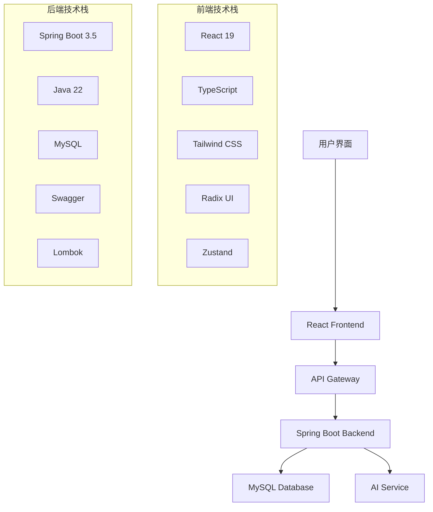

<div align="center">

# 🚀 Zero Code AI Platform


**🎯 零代码AI平台 - 让AI开发变得简单而强大**

[🌟 在线演示](https://your-demo-link.com) • [📖 文档](https://your-docs-link.com) • [🐛 问题反馈](https://github.com/your-repo/issues)

</div>

---

## ✨ 项目亮点

<table>
<tr>
<td width="50%">

### 🎨 **现代化前端**
- ⚡ **React 19** + **TypeScript** 
- 🎭 **Tailwind CSS** + **Radix UI**
- 🌙 **深色模式** 支持
- 📱 **响应式设计**
- 🔥 **Vite** 极速构建

</td>
<td width="50%">

### 🛡️ **强大后端**
- ☕ **Java 22** + **Spring Boot 3.5**
- 🗄️ **MySQL** 数据库
- 📝 **Swagger** API文档
- 🔧 **Lombok** 简化开发
- 🚀 **RESTful** API设计

</td>
</tr>
</table>

---

## 🏗️ 技术架构



---

## 🚀 快速开始

### 📋 环境要求

| 技术 | 版本要求 |
|------|----------|
| Java | 22+ |
| Node.js | 18+ |
| MySQL | 8.0+ |
| Maven | 3.8+ |
| pnpm | 8+ |

### 🔧 安装步骤

#### 1️⃣ 克隆项目
```bash
git clone https://github.com/your-username/zero-code.git
cd zero-code
```

#### 2️⃣ 后端启动
```bash
cd backend
# 配置数据库连接 (application.yml)
mvn clean install
mvn spring-boot:run
```

#### 3️⃣ 前端启动
```bash
cd frontend
pnpm install
pnpm dev
```

#### 4️⃣ 访问应用
- 🌐 前端地址: http://localhost:5173
- 📡 后端API: http://localhost:8080
- 📚 API文档: http://localhost:8080/swagger-ui.html

---

## 📁 项目结构

```
zero-code/
├── 📂 backend/                 # Spring Boot 后端
│   ├── 📂 src/main/java/      # Java 源码
│   ├── 📂 src/main/resources/ # 配置文件
│   ├── 📂 sql/                # 数据库脚本
│   └── 📄 pom.xml             # Maven 配置
├── 📂 frontend/               # React 前端
│   ├── 📂 src/                # 源码目录
│   │   ├── 📂 components/     # 组件库
│   │   ├── 📂 pages/          # 页面组件
│   │   ├── 📂 hooks/          # 自定义Hooks
│   │   ├── 📂 stores/         # 状态管理
│   │   ├── 📂 api/            # API接口
│   │   └── 📂 utils/          # 工具函数
│   ├── 📄 package.json        # 依赖配置
│   └── 📄 vite.config.ts      # Vite配置
└── 📄 README.md               # 项目说明
```

---

## 🎯 核心功能

<div align="center">

| 功能模块 | 描述 | 状态 |
|---------|------|------|
| 🤖 **AI代码生成** | 智能生成高质量代码 | ✅ |
| 🎨 **可视化编辑** | 拖拽式界面设计 | ✅ |
| 📊 **数据分析** | 实时数据可视化 | 🚧 |
| 🔐 **用户管理** | 完整的权限系统 | ✅ |
| 📱 **响应式设计** | 适配所有设备 | ✅ |
| 🌙 **主题切换** | 明暗主题支持 | ✅ |

</div>

---

## 🛠️ 开发工具

<div align="center">

### 前端开发


### 后端开发


</div>

---

## 📈 性能指标

<div align="center">

| 指标 | 数值 | 说明 |
|------|------|------|
| ⚡ **首屏加载** | < 2s | 极速响应 |
| 📦 **打包大小** | < 500KB | 轻量级应用 |
| 🔄 **API响应** | < 100ms | 毫秒级响应 |
| 📱 **移动适配** | 100% | 完美适配 |

</div>

---

## 🤝 贡献指南

我们欢迎所有形式的贡献！

### 🔄 贡献流程
1. 🍴 Fork 本仓库
2. 🌿 创建特性分支 (`git checkout -b feature/AmazingFeature`)
3. 💾 提交更改 (`git commit -m 'Add some AmazingFeature'`)
4. 📤 推送分支 (`git push origin feature/AmazingFeature`)
5. 🔀 创建 Pull Request

### 📝 代码规范
- ✅ 遵循 ESLint 规则
- 🎨 使用 Prettier 格式化
- 📖 编写清晰的注释
- 🧪 添加必要的测试

---

## 📄 许可证

本项目采用 MIT 许可证 - 查看 [LICENSE](LICENSE) 文件了解详情

---

## 👥 团队

<div align="center">

**💡 如果这个项目对你有帮助，请给我们一个 ⭐**

[⬆ 回到顶部](#-zero-code-ai-platform)

</div>

---

<div align="center">

### 🌟 Star History

[](https://star-history.com/#xie392/zero-code&Date)

**Made with ❤️ by Zero Code Team**

</div>